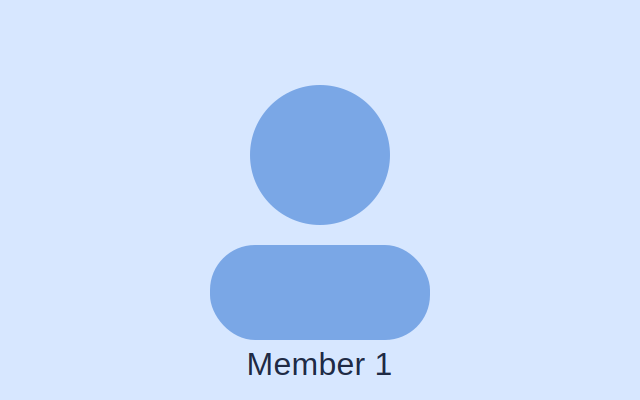
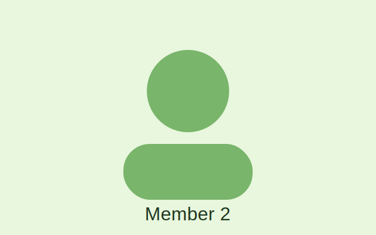
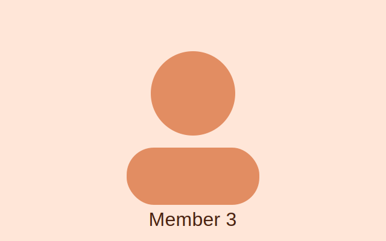

import { Card, CardGrid } from '@astrojs/starlight/components';

import { Image } from 'astro:assets';

import tidianePhoto from '../../assets/team/tidiane.jpg';
import AlexPhoto from '../../assets/team/Alex.png';
import BennettPhoto from '../../assets/team/Bennett.jpg';

# Meet the Team

Meet the three members of the BizRush team. 

<CardGrid>
<<<<<<< Updated upstream
	<Card title="Team Member 1" icon="user">
		
=======
	<CustomCard title="Bennett Moore" icon="mdi:account">
		<Image src={BennettPhoto} alt="Bennett Moore" />
>>>>>>> Stashed changes

		**Major:** Computer Science  
		**Role:** Lead Developer  
		**Year:** 4th Year  
		**Bio:** Add short bio here.
<<<<<<< Updated upstream
	</Card>
	<Card title="Team Member 2" icon="user">
		
=======
	</CustomCard>
	<CustomCard title="Tidiane Dia" icon="mdi:account">
		 <Image src={tidianePhoto} alt="Tidiane Dia" />
>>>>>>> Stashed changes

		**Major:** Computer Information Systems  
		**Role:** Associate Developer  
		**Year:** 4th Year  
		**Bio:** Add short bio here.
<<<<<<< Updated upstream
	</Card>
	<Card title="Team Member 3" icon="user">
		
=======
	</CustomCard>
	<CustomCard title="Alex Testa" icon="mdi:account">
		 <Image src={AlexPhoto} alt="Alex Testa" />
>>>>>>> Stashed changes

		**Major:** Computer Information Systems 
		**Role:** Associate Developer  
		**Year:** 4th Year 
		**Bio:** Add short bio here.
	</Card>
</CardGrid>

